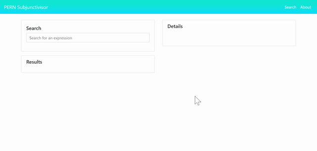
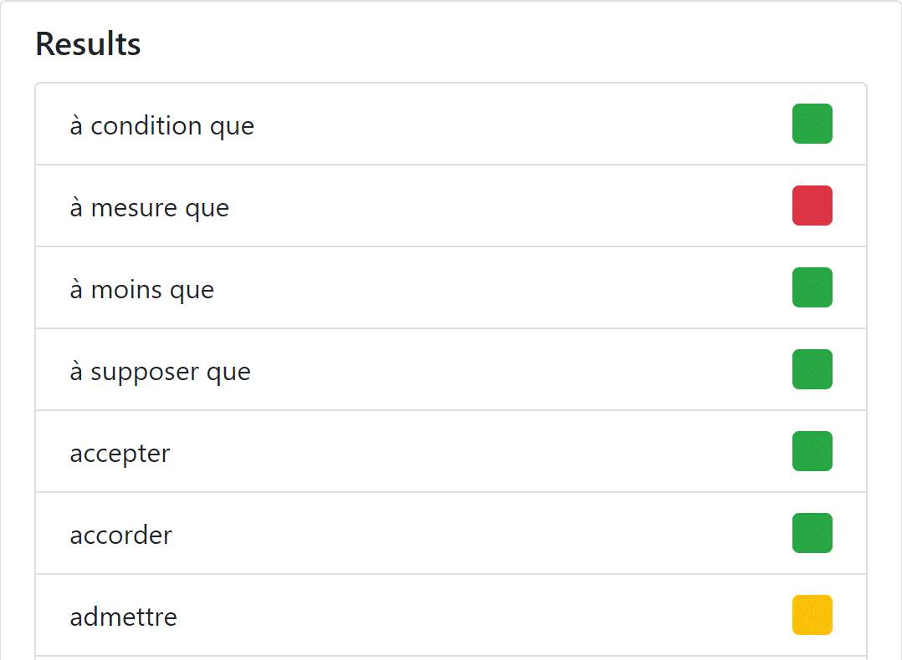
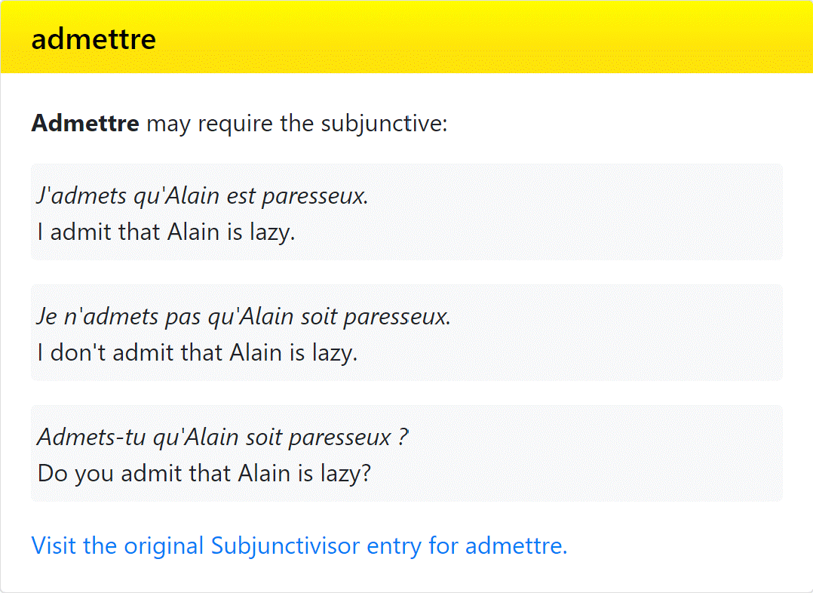

# PERN-Subjunctivisor
A PERN-stack implementation of Laura K. Lawless's French Subjunctivisor, allowing students of French to quickly look up when the subjunctive mood is required in a subclause.



# What does it do?
This app provides "search box" functionality to Lawless's French Subjunctivisor. Color-coded buttons next to the results list provide at-a-glance information, allowing users to see if the subjunctive mood is required. 



- A **green** square indicates that the subjunctive mood **is required**.
- A **red** square indicates that the subjunctive mood **is not to be used**.
- A **yellow** square indicates that the subjunctive mood **may or may not be used**, depending on context.



Users can click on an item under the "Results" tab to see more details, such as examples of clause in question. This can be particularly useful for those instances where the subjunctive mood may or may not be used, depending on the context.

All entries in the "Details" panel provide a link to the original page on Laura K. Lawless's website.

# Which technologies does it use?
The PERN-Subjunctivisor app utilizes:
- PostgreSQL
- Express.js
- React.js
- Node.js

In addition, data was collected from entries on Laura K. Lawless's website using Cheerio.

# Where can I find the app deployed?
Due to a request from Laura K. Lawless, this app is not deployed on Heroku. However, you can install it on your own computer Terminal (Mac OS X or Linux) or using Git Bash (Windows 10). Please note that the app requires [PostgreSQL](http://postgresql.org/) and [Node.js](https://nodejs.org/) installed on your computer.

You can install the app by using:

```bash
git clone https://github.com/ccostoso/PERN-Subjunctivisor.git
```

From there, run the following commands:
```bash
npm i
```

followed by

```bash
sequelize db:seed:all
```

and finally:

```bash
npm start
```

To stop the app, type CTRL+C in Terminal/Git Bash.

# What's next?
The current app is at its MVP stage, but in the future, use of cookies will allow users to "favorite" clauses for the future.

# Credits
Carlos Costoso (https://ccostoso.github.io/)
Laura K. Lawless (https://www.lawlessfrench.com/)

